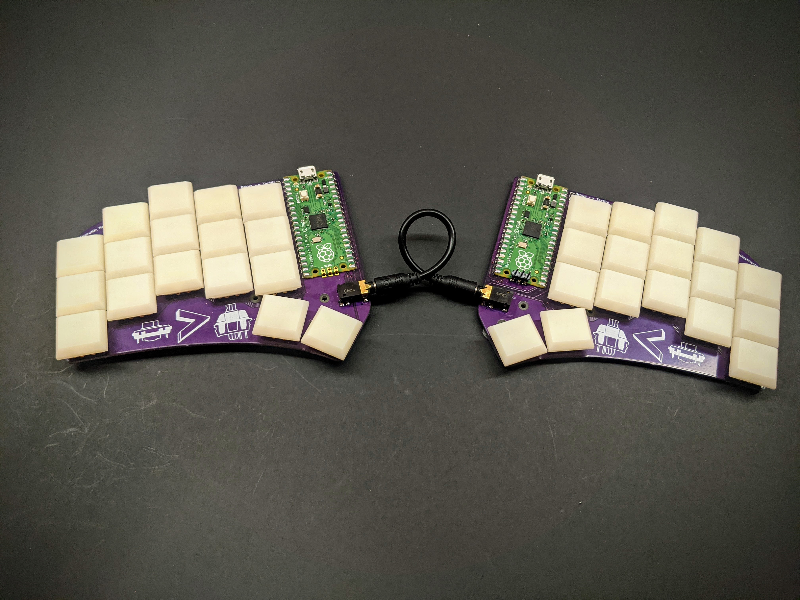
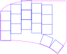

# pinci the keyboard 🦐

*pinci pinches panic like popcorn*

This project is still under development, submit an issue if you have questions.

## Hardware

- 34 key layout with two thumb keys skewed outward
- [Kailh PG1232](https://www.kailhswitch.com/news/pg1232-keyboard-switch-brief-introduction-21834938.html) Low Profile Switches
- [Raspbery Pi Pico](https://www.raspberrypi.org/products/raspberry-pi-pico/) (RP2040)
- Reversible PCB
- TRS capable hardware (normal headphone cable)
- Minimal SMD components and no THT components
- No diodes, just direct switch to gpio connections
- Useable with and without a case

## Firmware

The [firmware](https://github.com/camrbuss/pinci/blob/main/firmware/src/main.rs) is writen in Rust using the following (and more) libraries

- [Keyberon](https://github.com/TeXitoi/keyberon)
- [RTIC](https://github.com/rtic-rs/cortex-m-rtic)
- [rp2040-hal](https://github.com/rp-rs/rp-hal/tree/main/rp2040-hal)

## Inspiration

Thanks to all the open-source projects that have inspired this project

- [Ferris](https://github.com/pierrechevalier83/ferris)
- [Fifi](https://github.com/raychengy/fifi_split_keeb)
- [KeySeeBee](https://github.com/TeXitoi/keyseebee)

